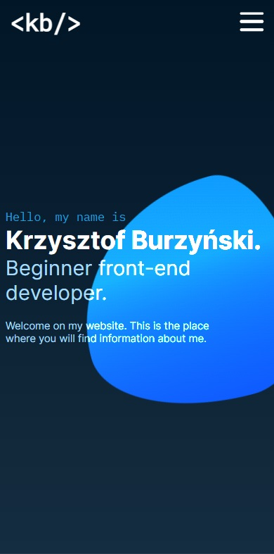
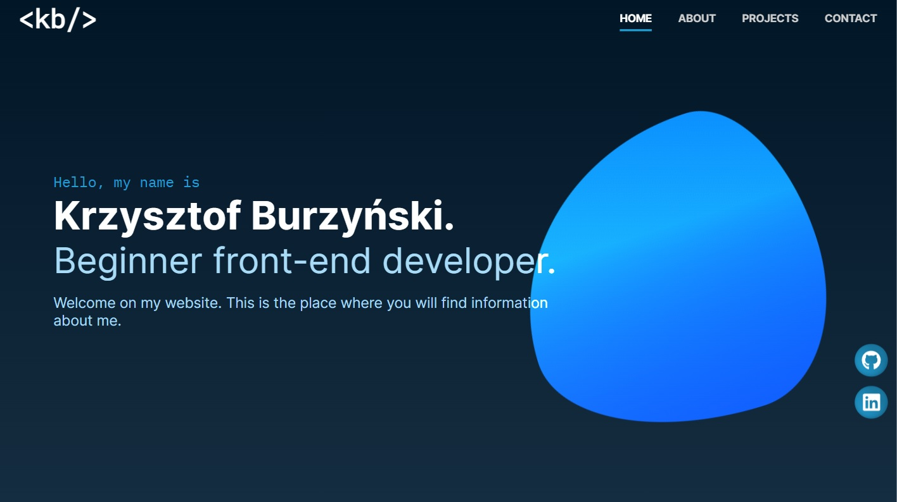

# Portfolio

## Table of contents
* [General info](#general-info)
* [Technologies](#technologies)
* [Screenshots](#screenshots)
* [Installation](#installation)
* [Available scripts](#available-scripts)
* [Live demo](#live-demo)

## General info
This is my portfolio website project. Get to know me better.

## Technologies
| Tech                                                    | Description                              |
| ------------------------------------------------------- | ---------------------------------------- |
| [TypeScript](https://www.typescriptlang.org/)                           | TypeScript is a strongly typed programming language that builds on JavaScript   |
| [React](https://reactjs.org/)                           | A JavaScript library for building user interfaces   |
| [ReactRouter](https://reactrouter.com/)                           | React Router is a standard library for routing in React   |
| [Framer Motion](https://www.framer.com/motion/)                           | A production-ready motion library for React   |
| [Sass](https://sass-lang.com/)                           | Professional grade CSS extension   |
| [Vite](https://vitejs.dev/)                           | Build tool that aims to provide a faster and leaner development experience   |


## Screenshots
<p align="center">
    
</p>
<p align="center">
    
</p>


## Installation

```bash
git clone https://github.com/MobbySchiller/portfolio.git
npm install
npm run dev
```

## Available scripts
| Command                   | Description                   |
| ------------------------- | ----------------------------- |
| `npm run dev`           | Open local server             |
| `npm run build`           | Create optimized build        |
| `npm run preview`            | Run local server on build version                    |

## Live demo
[Click here](https://kburzynski.com/)
